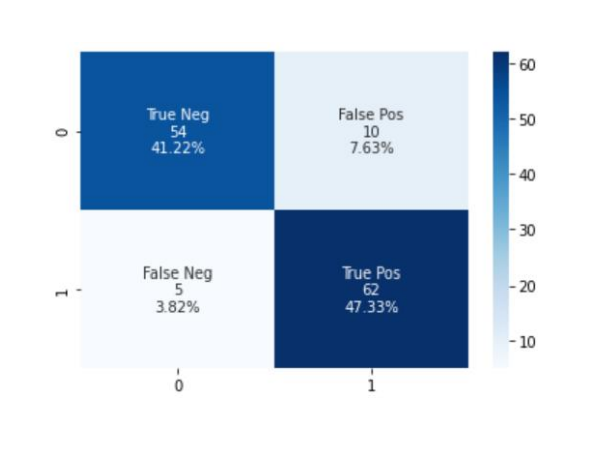
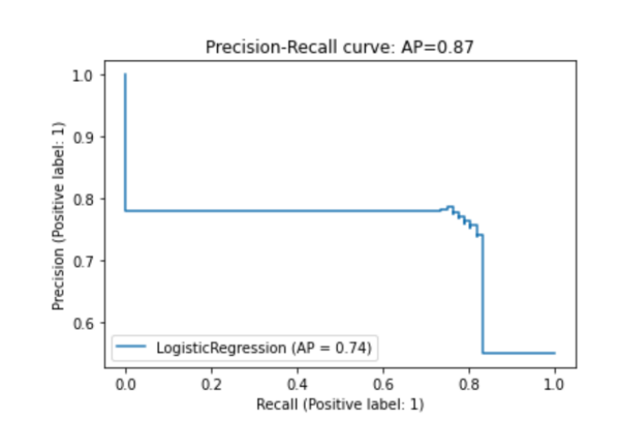

# CreditCard Approval using Machine Learning

A machine learning model that can predict credit card approvals from the described dataset. I've used Logistic regression for prediction.

* Logistic Regression Classification Accuracy Result -  **88.5%**
* Logistic Regression Balanced Accuracy Result - **88.8%**

## Confusion Matrix Result

## Precision Recall Curve

## Packages Required

* Python 3
* SkLearn
* Numpy
* Pandas
* Malplotlib

## MIT License

This project is covered under MIT License.
